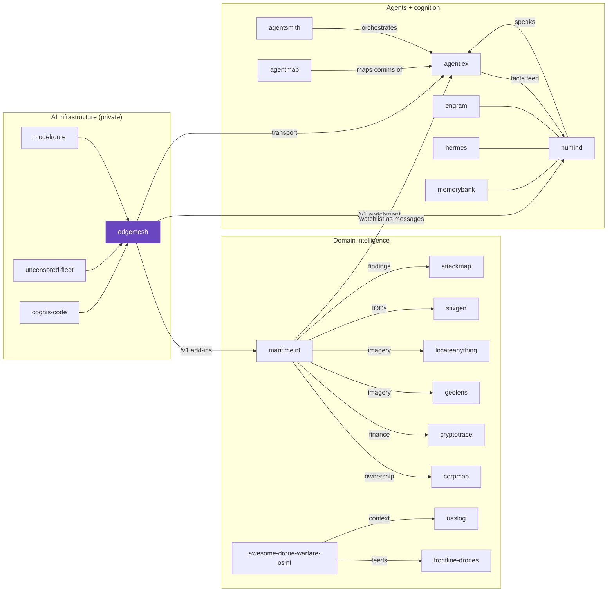

# Cognis interop map

How this repo fits into the wider Cognis suite. Everything is composable and runs on
your own hardware: a **private-AI backbone** (edgemesh), an **agent language + cognition**
layer (agentlex + humind), **domain intelligence** (maritime, drone, OSINT), and shared
**memory / intel** services.

## Key edges

| from | relation | to |
|---|---|---|
| modelroute / uncensored-fleet / cognis-code | are backends meshed by | **edgemesh** |
| edgemesh | serves `/v1` to the add-ins of | maritimeint, humind |
| edgemesh | is the transport/model layer under | agentlex |
| humind | expresses understanding as messages in | agentlex |
| agentlex | knowledge-base facts feed back into | humind |
| agentsmith | orchestrates workflows of | agentlex / humind agents |
| agentmap | discovers & maps the A2A comms of | agentlex agents |
| engram / hermes / memorybank | provide durable memory for | humind (semantic store) |
| maritimeint | cross-references ownership / finance via | corpmap / cryptotrace |
| maritimeint | geolocates imagery via | geolens / locateanything |
| awesome-drone-warfare-osint | feeds the catalog / C-UAS context of | frontline-drones / uaslog |
| maritimeint findings | export to intel formats via | stixgen (STIX) / attackmap (ATT&CK) |
| maritimeint watchlist | can be narrated as | agentlex messages (via humind) |

> Generated as part of a cross-repo interop pass. Each repo links here so the suite is
> navigable as one composable system. **280+ tools →** [github.com/cognis-digital](https://github.com/cognis-digital)
