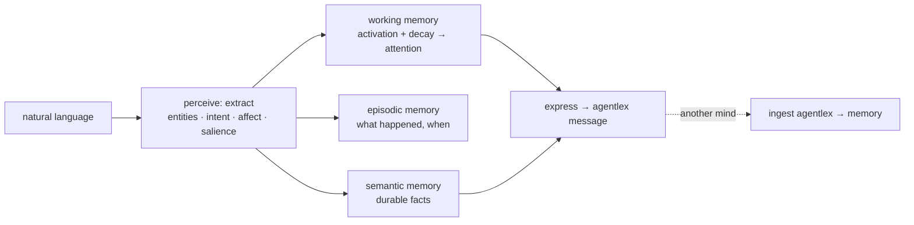

# humind

**A cognitive-architecture-inspired engine for extracting human context from natural
language** — and the companion to [`agentlex`](https://github.com/cognis-digital/agentlex):
humind is the *understanding*, agentlex is the *language* two minds speak.

> Honest scope: humind models *facets* of human cognition — **memory, attention,
> affect, and intent** — loosely inspired by ACT-R, SOAR, and Global Workspace Theory.
> It does **not** literally replicate the brain, and it doesn't pretend to. It is a
> transparent, explainable pipeline (lexicons + heuristics), not a black box.



## What it does

- **Perceive** — pull entities, the speech-act **intent** (inform/request/query/
  propose/agree/refuse), **affect** (valence + arousal/urgency), and **salient** terms
  out of an utterance, transparently.
- **Remember** — three stores: **working** (capacity-bounded, decaying → the current
  *attention*), **episodic** (time-ordered events), **semantic** (durable facts).
- **Speak** — turn understood context into an `agentlex` symbolic message (`express`),
  and fold a received message back into memory (`ingest`). That's the tandem.

## Install & try

```bash
pip install "git+https://github.com/cognis-digital/humind.git"   # pulls agentlex too
humind perceive "URGENT: vessel NEPTUNE-STAR went dark near a high-risk corridor"
humind think "scout reports contact" "command requests a scan" "I think we reroute"
humind demo        # two minds converse via agentlex
```

```python
from humind import Mind
scout, command = Mind("scout"), Mind("command")
scout.perceive("CRITICAL: vessel NEPTUNE-STAR is a high risk threat")
msg = scout.express()          # -> agentlex: inform … :: observed(neptune-star, high)
command.ingest(msg)            # command now knows it, and it's in focus
print(command.attention())     # ['neptune-star']
```

## The tandem
`humind` ⇄ `agentlex`: understanding produces language; language updates understanding.
Two (or many) humind agents exchange precise, *unifiable* symbolic messages instead of
ambiguous free text — so a query pattern from one mind matches a fact from another.

## Designed to interop
- [`agentlex`](https://github.com/cognis-digital/agentlex) — the symbolic A2A language (hard dependency).
- [`engram`](https://github.com/cognis-digital/engram) · [`hermes`](https://github.com/cognis-digital/hermes) · [`memorybank`](https://github.com/cognis-digital/memorybank) — durable backends for semantic memory.
- [`edgemesh`](https://github.com/cognis-digital/edgemesh) — run an optional LLM enrichment step privately on your own fleet.

## License
Cognis Open Collaboration License (COCL) 1.0 — see [LICENSE](LICENSE).
