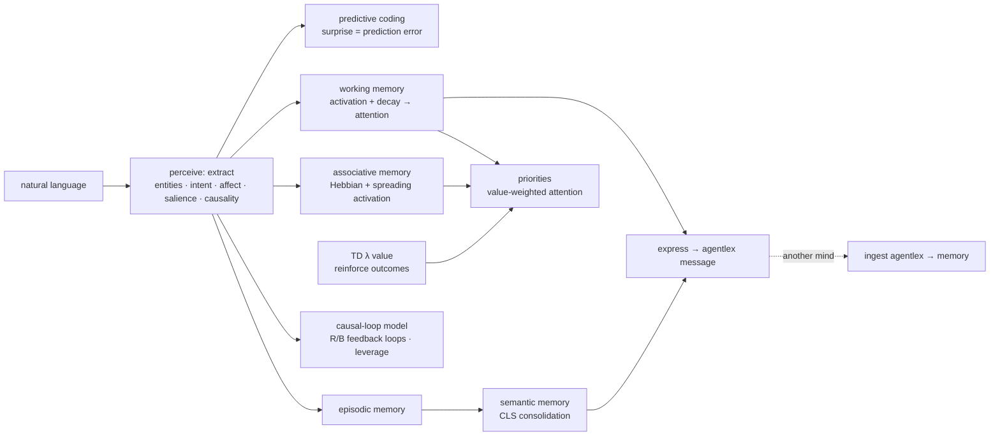

# humind

**A cognitive-architecture-inspired engine for extracting human context from natural
language** — and the companion to [`agentlex`](https://github.com/cognis-digital/agentlex):
humind is the *understanding*, agentlex is the *language* two minds speak.

> Honest scope: humind models *facets* of human cognition — **memory, attention,
> affect, and intent** — loosely inspired by ACT-R, SOAR, and Global Workspace Theory.
> It does **not** literally replicate the brain, and it doesn't pretend to. It is a
> transparent, explainable pipeline (lexicons + heuristics), not a black box.



## What it does

- **Perceive** — pull entities, the speech-act **intent** (inform/request/query/
  propose/agree/refuse), **affect** (negation-aware valence + arousal/urgency),
  **salient** terms, and **causal links** out of an utterance, transparently.
- **Remember** — four stores: **working** (capacity-bounded, decaying → *attention*),
  **episodic** (events), **semantic** (durable facts, grown by **CLS consolidation**),
  and **associative** (Hebbian co-occurrence → **spreading activation** / cued recall).
- **Learn** — `reinforce(reward)` does **TD(λ)** credit assignment with eligibility
  traces, so the mind discovers *which context mattered*; unseen words acquire affect
  online (**Rescorla-Wagner**). It **predicts** the next context and tracks **surprise**.
- **Reason about structure** — builds a **causal-loop diagram**, finds **reinforcing /
  balancing feedback loops**, and ranks **leverage points** (systems thinking).
- **Speak** — turn understood context into an `agentlex` symbolic message (`express`),
  and fold a received message back into memory (`ingest`). That's the tandem.

## How it thinks — grounded mechanisms, not buzzwords

Every layer is a named, explainable mechanism from the literature — pure stdlib, no tensors:

| Capability | Mechanism | Lineage |
|---|---|---|
| attention / forgetting | activation + decay, capacity bound | ACT-R · Miller 7±2 · Global Workspace |
| association / recall | Hebbian co-occurrence + spreading activation | Hebb · Collins & Loftus |
| learning from outcomes | TD(λ) with eligibility traces | Sutton & Barto |
| affect acquisition | Rescorla-Wagner delta rule | classical conditioning |
| prediction / attention gain | predictive coding (surprise = error) | Friston / free-energy |
| memory consolidation | Complementary Learning Systems | McClelland & O'Reilly |
| structural reasoning | causal-loop diagrams, R/B loops, leverage | Forrester · Sterman · Meadows |

```bash
humind causal "AIS gap leads to escalation" "sanctions pressure drives dark activity" \
              "dark activity increases sanctions pressure"
#   ais gap --(+)--> escalation ; reinforcing loop R: sanctions pressure <-> dark activity
humind learn      # an unseen word ("shadowfleet") acquires negative valence from outcomes
humind bench      # ~3,700 frames/sec, pure stdlib
```
```python
from humind import Mind
m = Mind()
for _ in range(6):
    m.perceive("detected a shadowfleet maneuver near the strait")
    m.reinforce(-1.0)                 # this context preceded a bad outcome
m.perceive("another shadowfleet contact").valence   # < 0 — learned it's threatening
m.feedback_loops(); m.leverage_points(); m.priorities()
```

<!-- cognis:domains:start -->
## Domains

**Primary domain:** AI & ML  ·  **JTF MERIDIAN division:** ATHENA-PRIME · SAGE

**Topics:** `cognis` `ai` `llm` `machine-learning` `agent-security`

Part of the **Cognis Neural Suite** — 300+ source-available tools organized across 12 domains under the JTF MERIDIAN command structure. See the [suite on GitHub](https://github.com/cognis-digital) and [jtf-meridian](https://github.com/cognis-digital/jtf-meridian) for how the pieces fit together.
<!-- cognis:domains:end -->

## Install & try

```bash
pip install "git+https://github.com/cognis-digital/humind.git"   # pulls agentlex too
humind perceive "URGENT: vessel NEPTUNE-STAR went dark near a high-risk corridor"
humind think "scout reports contact" "command requests a scan" "I think we reroute"
humind demo        # two minds converse via agentlex
```

```python
from humind import Mind
scout, command = Mind("scout"), Mind("command")
scout.perceive("CRITICAL: vessel NEPTUNE-STAR is a high risk threat")
msg = scout.express()          # -> agentlex: inform … :: observed(neptune-star, high)
command.ingest(msg)            # command now knows it, and it's in focus
print(command.attention())     # ['neptune-star']
```

## Optional LLM enrichment (stays optional)

The core extractor is transparent and offline. When a model backend is reachable, you
can *augment* it with a concise analyst interpretation — without giving up explainability:

```bash
export HUMIND_ENDPOINT=http://<edgemesh-or-fleet>:8780   # or --endpoint
humind perceive "vessel NEPTUNE-STAR went dark" --ai      # adds a `notes` reading
```
No backend reachable? Enrichment is silently skipped; the stdlib frame is unchanged.

## Executable interop demo

The interop map, *running* — [`examples/cluster_demo.py`](examples/cluster_demo.py):

```
[maritimeint] watchlist: ['NEPTUNE STAR', 'QUIET DAWN', 'GHOST RUNNER']
[humind->agentlex] inform from:analyst to:broadcast :: observed(neptune-star, high)
[agentlex] escalations derived: ['escalate(neptune-star)']   # rule: high-risk AND sanctioned
```

A maritimeint watchlist → humind understands each finding → expresses it in agentlex →
an agentlex knowledge-base rule derives which vessels to **escalate** → (optionally) an
edgemesh-routed model writes the brief. Uses real maritimeint data if installed, a sample
otherwise; the edgemesh step is skipped gracefully with no backend.

## The tandem
`humind` ⇄ `agentlex`: understanding produces language; language updates understanding.
Two (or many) humind agents exchange precise, *unifiable* symbolic messages instead of
ambiguous free text — so a query pattern from one mind matches a fact from another.

## Designed to interop
- [`agentlex`](https://github.com/cognis-digital/agentlex) — the symbolic A2A language (hard dependency).
- [`engram`](https://github.com/cognis-digital/engram) · [`hermes`](https://github.com/cognis-digital/hermes) · [`memorybank`](https://github.com/cognis-digital/memorybank) — durable backends for semantic memory.
- [`edgemesh`](https://github.com/cognis-digital/edgemesh) — run an optional LLM enrichment step privately on your own fleet.

## License
Cognis Open Collaboration License (COCL) 1.0 — see [LICENSE](LICENSE).

---
📡 **[Interop map](INTEROP.md)** — how this repo composes with the rest of the Cognis suite (private-AI backbone, agent language + cognition, domain intelligence).
