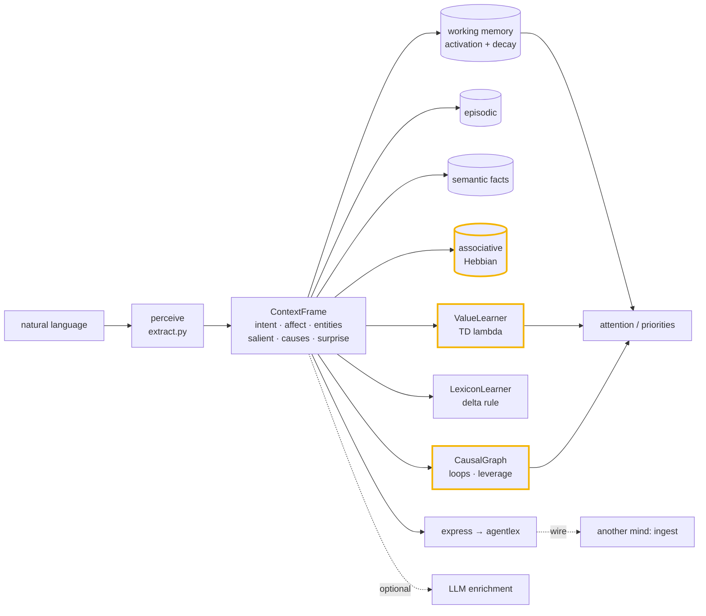
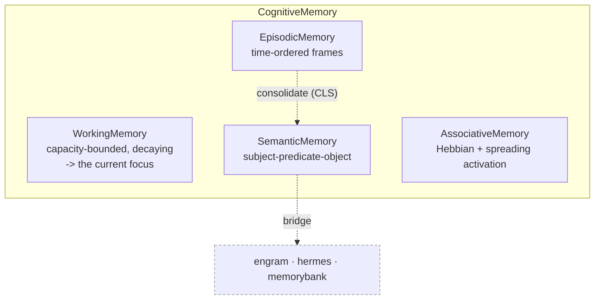
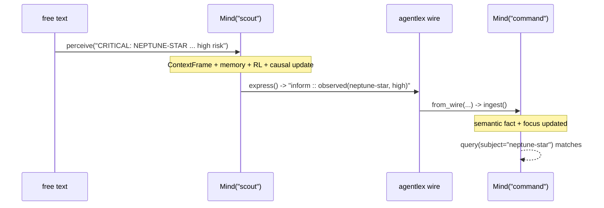

# Architecture

`humind` is a cognitive-architecture-*inspired* engine for extracting human context
from natural language and reasoning over it. It models *facets* of cognition —
**perception, attention, memory, affect, reinforcement learning, prediction, and
systems-level causal reasoning** — as a transparent, explainable pipeline (lexicons,
heuristics, and named update rules from the literature), then **speaks** that
understanding to other agents in
[`agentlex`](https://github.com/cognis-digital/agentlex). It does not literally
replicate the brain, and it doesn't pretend to — every layer is a mechanism you can
read, not a black box.

## The cognitive loop

## Mechanisms — grounded, not buzzwords

Every layer is a named mechanism from the literature, implemented in pure standard
library (no tensors, no training loop — just the update equations):

| Capability | Mechanism | Lineage | Module |
|---|---|---|---|
| attention / forgetting | activation + geometric decay, capacity bound | ACT-R · Miller 7±2 · Global Workspace | `memory.py` |
| association / recall | Hebbian co-occurrence + spreading activation | Hebb · Collins & Loftus | `memory.py` |
| learning from outcomes | TD(λ) with eligibility traces | Sutton & Barto | `learning.py` |
| affect acquisition | Rescorla-Wagner delta rule | classical conditioning | `learning.py` |
| prediction / attention gain | predictive coding (surprise = error) | Friston / free energy | `mind.py` |
| memory consolidation | Complementary Learning Systems | McClelland & O'Reilly | `memory.py` |
| structural reasoning | causal-loop diagrams, R/B loops, leverage | Forrester · Sterman · Meadows | `systems.py` |

## Components

### Perception (`humind/extract.py`)
Turns one utterance into a `ContextFrame`, stdlib-only and inspectable: the
speech-act **intent**, **affect** (`valence, arousal`, *negation-aware* — "not safe"
flips), **entities**, **salient** terms, and **causal links** (`(cause, effect,
polarity)` triples parsed from causal connectives). `extract()` accepts an optional
learned lexicon so affect can reflect experience.

### Memory (`humind/memory.py`)
Four stores under one `CognitiveMemory`:

- **WorkingMemory** — each item carries an **activation**, bumped by salience and
  multiplied by `decay` every `tick()`; items below `threshold` are evicted. `focus(k)`
  is the most-active items — attention is *emergent*, not assigned.
- **EpisodicMemory** — an ordered `(timestamp, frame)` log; `recent(n)` / `search(term)`.
- **SemanticMemory** — a set of `(subject, predicate, object)` facts, queryable by slot.
- **AssociativeMemory** — a Hebbian co-occurrence network. `coactivate()` strengthens
  pairwise links between items attended together; `spread()` propagates activation one
  hop, so cueing one concept brings associated ones to mind.
- **`consolidate()`** — Complementary Learning Systems: entities recurring across
  episodes are distilled from the fast episodic log into durable semantic facts.

### Reinforcement learning (`humind/learning.py`)
- **ValueLearner** — TD(λ) with accumulating **eligibility traces**. `attend()` decays
  every trace then bumps the attended items; `reinforce(reward)` credits each item in
  proportion to its trace, so reward flows back to the context that *preceded* the
  outcome, several steps later if need be.
- **LexiconLearner** — online valence learning by the Rescorla-Wagner delta rule: words
  in a reinforced episode have their affect nudged toward the reward's sign, so an
  unseen domain word *acquires* affect from experience.

### Systems thinking (`humind/systems.py`)
`CausalGraph` assembles a **causal-loop diagram** from the `causes` triples.
`feedback_loops()` finds cycles and labels each **R** (reinforcing — even number of
negative links, self-amplifying) or **B** (balancing — odd, self-correcting).
`leverage_points()` ranks concepts by causal centrality (Meadows: the most connected
structural nodes are where intervention has the most reach).

### The cognitive loop (`humind/mind.py`)
`Mind` ties it all together. `perceive(text)` extracts a frame (with learned lexicon),
computes **predictive-coding surprise** (the fraction of the input it did not expect),
logs it episodically, precision-weights attention by `arousal + surprise`, fires
Hebbian co-activation, marks RL eligibility, and grows the causal model. On top:
`attention()` / `predict()` / `reinforce()` / `priorities()` (value- and
centrality-weighted focus) / `consolidate()` / `leverage_points()` / `feedback_loops()`.
And the **agentlex tandem**: `express(frame)` → an `agentlex.Message`
(`observed(entity, affect-label)`); `ingest(message)` folds a received message back
into memory. `agentlex` is a soft dependency — the core works without it.

### Optional LLM enrichment (`humind/addins.py`)
When an OpenAI-compatible backend is reachable (`HUMIND_ENDPOINT` / `OPENAI_BASE_URL`,
or auto-discovered on common local ports — edgemesh, fleet, Ollama, vLLM …),
`interpret()` adds a concise analyst reading as a `notes` annotation. Pure `urllib`.
**No backend → enrichment is silently skipped and the stdlib frame is unchanged.**

## The tandem, in one picture

## Why these choices

- **Transparent by construction.** Every field and every update traces to a lexicon,
  a heuristic, or a published update rule you can read — not a black-box score.
- **Offline-first.** The core is pure standard library: no weights, no data leaves the
  machine. LLM enrichment is strictly optional and degrades to a no-op.
- **Composable.** Understanding (`humind`) and language (`agentlex`) are separate
  layers; semantic memory is the documented bridge to durable backends (`engram`,
  `hermes`, `memorybank`).
